## What it is

Jeeves is 1 page in your web browser, served by a small program on your own computer. The page is split into panels. Each panel does 1 job. You can drag a panel anywhere, stack panels as tabs, close a panel and bring it back, make a group of panels fill the screen, and pop any panel out into its own window so it can sit on a second screen.

This is piece 4 of 4 in the agent workspace. Install them in order: 1 agent-flow, 2 FleetView, 3 ProjectForge, 4 Jeeves. Each one also works on its own; Jeeves shows ProjectForge and FleetView inside 2 of its panels when they are running.

**There is no voice in this download.** The Jeeves Ashley showed you live spoke its answers out loud. This one does not: it has no voice and no microphone, and every answer arrives as text. Ashley's first voice was a copy of a real narrator's voice, which carries legal and reputational risk, so it was left out. To add a voice yourself, idea 6 under "Fit it to your own AI system" is a prompt that uses the speaking voices already built into your web browser: no copied voice, and no extra program.

### Words used in this guide

| Word | What it means here |
|---|---|
| Vault | A folder of notes. You have 2: your second brain, and your CRM. |
| CRM | Your customer-records notes: the folder of people and conversations you built in the CRM sessions. |
| Claude Code | The Claude program you type to in a terminal. Jeeves sends your chat messages to it. |
| Terminal | The text window where you type commands. On a Mac the app is called Terminal: press Command and Space together, type Terminal, press Return. |
| `~` | Short for your home folder, the folder with your name and the house picture in Finder's sidebar. `~/CRM` is the folder called CRM inside it. |
| Token | The unit Claude's usage is counted in. 4 tokens are about 3 words. |
| Model | Which Claude model answers. Jeeves offers 3, each named in full: Claude Opus 5.5 (strongest), Claude Sonnet 5 (middle) and Claude Haiku 4.5 (cheapest). |
| Agent | A saved set of instructions Claude Code can hand a job to, kept in a `.claude/agents` folder. |
| Tools | What Claude can do besides talk: read files, edit files, run commands, search the web. |
| Rulebook | The `CLAUDE.md` file of instructions in your second brain. Claude Code reads it first. |
| Markdown | Plain text notes that end in `.md`, the kind your second brain is made of. |
| 127.0.0.1 and localhost | 2 ways of writing "this computer". An address that starts with either of them opens only on your own computer. |
| Port | The number after the colon in an address such as http://127.0.0.1:4040. It picks out which program on your computer answers. In this set of 4: agent-flow 3001, FleetView 3010, ProjectForge 3020, Jeeves 4040. |
| Repo | A project's folder of code, kept on GitHub. `git clone` copies it to your computer. |
| `config.json` | The file that keeps Jeeves's settings. The installer writes it. |


The numbers on the next picture point at the parts you will use most. The key under the picture says what each one is.

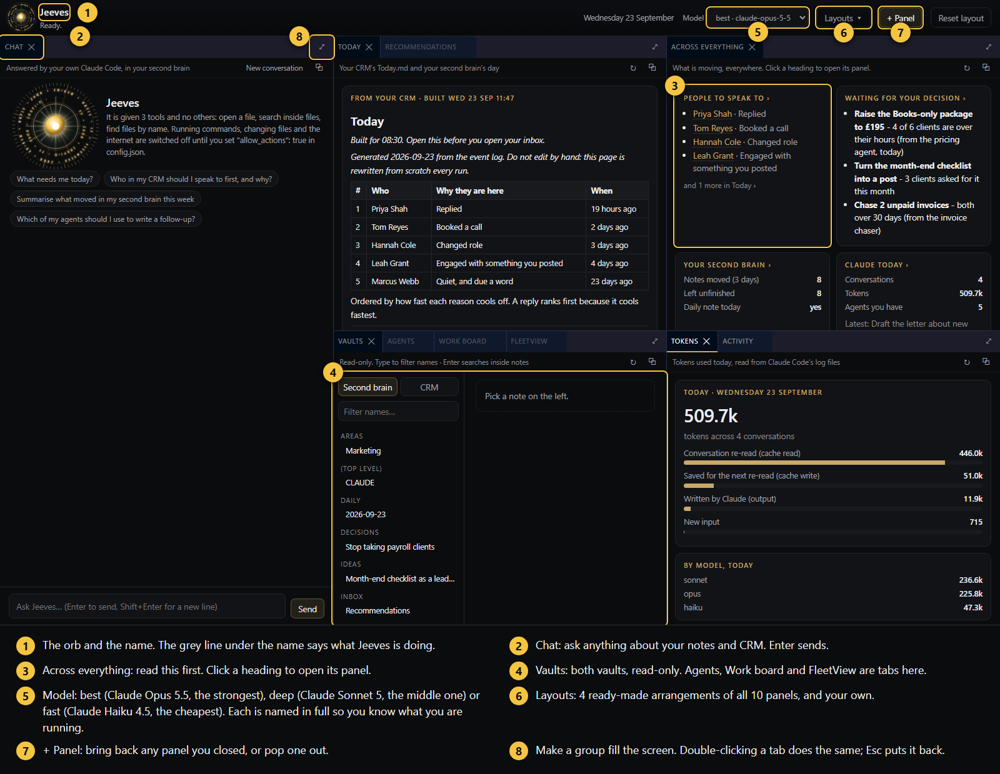

The 10 panels:

| Panel | What you see |
|---|---|
| Chat | A conversation with your own Claude Code. It works inside your second-brain folder, with your CRM folder added, so it can read both. By default it is given 3 tools and no others: open a file, search inside files, find files by name. |
| Today | The ranked list of people to contact that your CRM writes each morning (a file called `Today.md` at the top of your CRM folder, built in part 7 of the CRM sessions), plus your second brain's day: today's daily note if you keep one, notes that changed in the last 3 days, and to-do checkboxes in your notes that you have not ticked yet. |
| Across everything | 1 screen that sums up what is moving: people to speak to, decisions waiting for you, notes that changed, Claude use today, and whether your other apps are running. Click any heading to open its panel. |
| Recommendations | A note in your second brain (`Inbox/Recommendations.md`) that you and your agents write suggestions into. |
| Vaults | Both note folders, read-only. Filter by name, search inside every note, and click a link between notes (a note name inside double square brackets, like `[[Pricing review]]`) to open that note. |
| Agents | Every Claude Code agent you have, with what each one is for, and an "Ask in chat" button. |
| Activity | Your recent Claude Code conversations: which folder, how many turns, how many tokens. |
| Tokens | Today's tokens, by kind and by model, read from Claude Code's own log files. |
| Work board | ProjectForge, the work board for your agents from piece 3 of 4, shown inside the panel when it is running. |
| FleetView | FleetView, the screen that shows every running agent session, from piece 2 of 4, shown inside the panel when it is running. |

At the top left, and above the chat, is the orb: an animated circle of light with 2 rings of rune-style lettering. It turns slowly when Jeeves is idle, pulses while Claude is thinking, and brightens while the answer is coming in.

## Why you would want it

Once you run agents, your work is spread across folders, terminals and apps. Your CRM has who to call, your second brain has what you decided, and Claude Code's log files record what it did today and how many tokens that used, but each sits in its own folder or window.

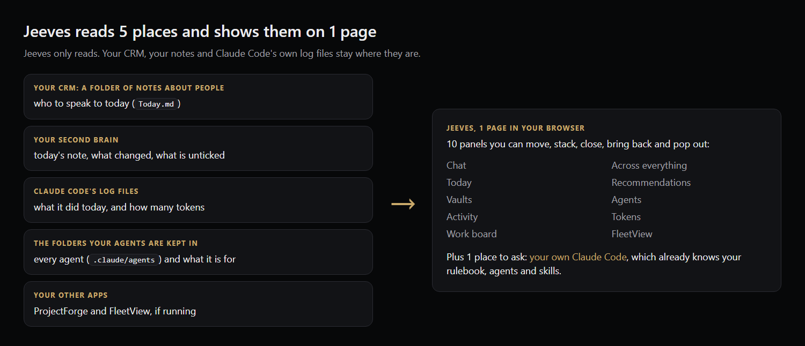

Jeeves puts them on 1 screen and gives you 1 place to ask a question about any of them. The answer comes from your own Claude Code, so it already knows your rulebook (the `CLAUDE.md` file), your agents and your skills. It costs nothing beyond your Claude subscription, and nothing leaves your computer except the messages Claude Code itself sends.

Ashley's decision on what Jeeves is for, made on 2026-06-20: it is a full cockpit where every job Jeeves does gets its own panel. In his words: "Jeeves is a FULL UI - that's the point." (UI means user interface: the whole screen you work in.) This download keeps that: every panel stays, and the Layouts menu (top right of the page) arranges them for the screen you have.

### What it is for

Putting your day, both note folders, your agents and your Claude usage side by side on 1 page, with 1 chat box that asks your own Claude Code about any of them.

### Works well when

- **Your morning starts in 5 places.** Who to contact, what changed in your notes, what your agents are doing, how much of your Claude plan you have spent today, and whether ProjectForge and FleetView are running: all on 1 screen instead of 5.
- **You want to ask a question about your own notes** without opening a terminal and without typing out your business, your clients and your way of working again at the start of every chat, because the answer comes from your own Claude Code, which has already read the `CLAUDE.md` rulebook in your second brain.
- **You want today's token count beside the conversations that spent it**, rather than a bare total you cannot trace back to any piece of work.
- **You already run pieces 2 and 3 of 4.** The work board and FleetView appear inside 2 of the panels, so 3 of the 4 pieces share 1 browser tab.
- **You have a second screen.** Pop each panel you watch out into a browser window of its own and leave it there all day.

### Does not work well when

- **You expect it to remember.** Jeeves keeps no record of your work. It keeps its own settings in `config.json`, and in its `state` folder the number of the conversation it is carrying on and the ID of the copy that is running. Every panel reads your notes and Claude Code's log files fresh each time, and your chat messages live only in Claude Code's own log files, in the `.claude` folder in your user folder. Nothing you type here builds up into a record you can search later.
- **You treat the chat box as free.** Every message starts a real Claude Code run, which re-reads your `CLAUDE.md` rulebook and the conversation so far before it answers. 20 questions you did not really need will spend real tokens from your Claude plan; the panels that only read your files spend none.
- **You switch writing on and then ask it about notes you clipped from websites.** A note you clipped from a website can carry written instructions aimed at an AI: rewrite this file, empty that folder, send what you find. A Claude that is allowed to write may do exactly that to your notes. Out of the box Chat can only read, and you have to change 2 settings, `"allow_actions"` and `"permission_mode"` in `config.json`, before it can write anything.
- Jeeves reads markdown files on your own disk. If your notes live in a web app, there is nothing here for it to read, and the sensible move is not to install it yet.
- **You want it away from your desk.** It answers on your own computer only. Ashley reached his from a phone, and that needed a VPN, a private network only his own devices could join, set up on top of everything in this guide.

## How we built it

Ashley built the original Jeeves for himself in June 2026. Every date below comes from his build notes and records, and the pictures are his real screens. The download you get is a clean rebuild of the parts that worked, for your setup rather than his.

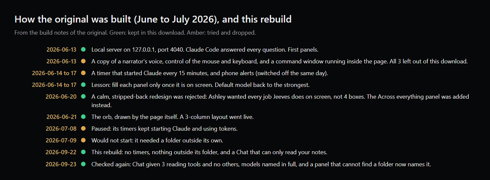

### 2026-06-13: most of the system in 1 day

- **A web server on 127.0.0.1, port 4040** (open it at http://127.0.0.1:4040), written using only the parts that come with Python, so there is nothing extra to install. We kept this exactly.
- **Claude Code replaced the home-made search.** The first version always used 1 small, cheap Claude model and searched the notes with its own Python code, badly. It was replaced by a small program that sends each question to the real Claude Code (the `claude -p` command, which answers 1 question and exits), with every note folder opened to it. We kept this: every answer in Jeeves comes from your own Claude Code.
- **Permission levels.** Every action was sorted into 1 of 3 levels: refused, ask Ashley first, or allowed. Then came control of the computer itself (screenshots, opening programs, typing), with clicks and keypresses needing his approval. This download leaves computer control out.
- **Voice.** 5 speech programs were compared. The winner was Chatterbox, a free speech program (under the MIT licence, which lets anyone use it). It ran a cloned voice made from a well-known narrator's audiobook clips. It took 34 seconds to start and about 4 seconds per reply once it had started up. The clone was marked private-only, because the narrator has publicly objected to voice cloning.
- **The microphone "not working"** turned out to be a fake microphone (software that records nothing) set as the default microphone on his PC. Fixed by adding a list of microphones to choose from that leaves the fake ones out.
- **Movable panels** from Dockview (a free add-on that lets you drag a panel around a web page and snap it to an edge), a 3D map of agents, a live command window (the text window where you type commands), a switch between a quick model and a thorough one, email and calendar readers, a check that started Claude every 45 minutes to look for news, and the first Inbox panel (a list of decisions waiting for Ashley).

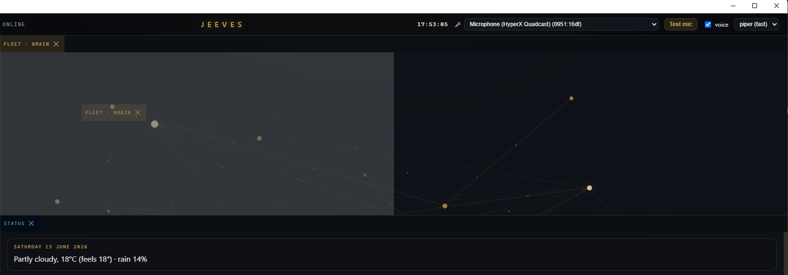

### 2026-06-14 to 2026-06-17: additions

- **A timer every 15 minutes** that started Claude to research each new decision in Ashley's list before he said yes or no to it.
- **Phone alerts** were built and switched off the same day, on Ashley's word.
- **An empty panel.** The Status panel tried to write its contents before the panel existed on screen, so it stayed empty. This rebuild fills each panel only once it has appeared on screen, never earlier.
- **Other apps inside panels.** ProjectForge and Ashley's LinkedIn messaging app were shown as real apps inside panels, and any panel could pop out into its own window for his 3 monitors.
- **"Jeeves suddenly dumb."** The default model had been switched to the smallest, fastest one. It fumbled tasks with several steps. Ashley's decision: the strongest model by default. This rebuild's default is `best`, the strongest Claude model.
- **Speed.** Keeping Claude Code open between messages, instead of starting it fresh each time, cut the wait for the first word from 3.7 seconds to 1.4 seconds.
- **The phone app** was installed on 2026-06-15. Its login screen left the phone stuck with no way forward, and Ashley said "get rid of all the auth" (auth: the login check). From then on the only way in was his own private network, which only his devices could join.
- **Telegram.** Ashley had been messaging his agents through Telegram, a chat app. On 2026-06-16 he stopped: Jeeves replaced it.

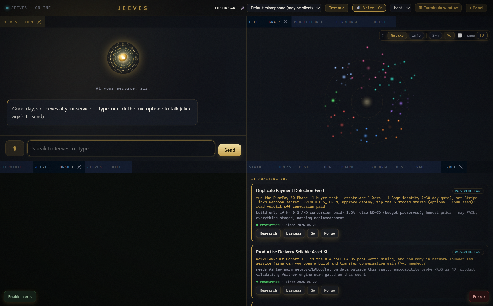

### 2026-06-20: the redesign Ashley rejected

A new design went through Ashley's usual review: research, a first plan, a written critique of it, a second plan, a second critique and a final plan. It proposed a "calm butler" design: 1 orb, 1 conversation, at most 4 boxes of information, with the command panels and the agent map removed. Ashley's verdict: "it looks better but it uses most of the current usability" (he meant it loses most of what he could do with it), then "Jeeves is a FULL UI - that's the point". The plan was corrected to keep every panel and add a column that sums up what is moving across conversations, projects, outreach and agents. In this download that column is the **Across everything** panel.


### 2026-06-20 to 21, overnight: the orb

Ashley wanted Jeeves to look like a character from an anime. Claude's first 2 attempts at the look he described were wrong. The fix was an original animated circle that the page draws itself (with SVG, a way of drawing shapes in a web page), so the download contains no copyrighted picture. In the original it reacted to the microphone and to the voice. This download has no microphone and no voice, so its orb reacts to what Chat is doing instead. Its 2 rings of rune-style lettering each spell out a line of text, and the text is yours to set.


### 2026-06-21 to 2026-07-09: the new layout, then the pause

- **2026-06-21:** a 3-column layout went live as the default, with the old layout still reachable at the address http://127.0.0.1:4040/v1.
- **2026-06-22:** a separate hands-free voice-control program was built and archived the same day. It took 0.5 seconds at best to hear the words and start, on top of the wait for Claude's answer, which was not fast enough.
- **2026-07-01 to 02:** a code review found that if the file that stores the logins was damaged, Jeeves let everyone in instead of locking. It was fixed to lock. It also found that Jeeves started its own copy of Ashley's LinkedIn messaging app on the same port the real app used, so the old copy kept answering, and when Ashley fixed the real app the fix seemed to change nothing.
- **2026-07-08:** the last timer run. Jeeves was switched off because its timers kept starting Claude and using tokens. On the same date ProjectForge was switched off for using about 230 million tokens of text read by Claude in 30 days. Both used tokens the same way: a timer started a fresh Claude conversation over and over, whether or not there was work. No separate token count for Jeeves was recorded.
- **2026-07-09:** the last attempt to start it failed, because a folder it needed (the voice code) was missing. The server would not run without files that lived outside its own folder.

### 2026-09-22: what testing this download found, and fixed

Before this download went out, 3 people checked it: a stranger followed this guide step by step, a reviewer used every panel, and a security reviewer tried to break it. What they found, and what changed:

- **Chat could still use tools you had allowed elsewhere.** The setting Jeeves used only switched off tools you had never turned on yourself. Any tool you had already allowed in your own Claude Code settings stayed available to Chat. Jeeves started naming the tools to block on every message. A day later that proved not to be enough either: see 2026-09-23 below.
- **Stop did not stop Claude** when Claude Code was installed with npm (the installer that comes with Node.js, a program many developer tools need), because that kind of install starts the real Claude as a second, hidden program. Stop now ends both.
- **2 copies could share port 4040 on a PC**, and stopping Jeeves then stopped only 1 of them. Now only 1 copy can run per port, and starting it again says it is already running.
- **After 1 failed message, every later message failed**, because Jeeves saved the number Claude Code uses to carry on a conversation, even for the failed one, so every later message tried to carry on a broken conversation. A failed message is now never saved.
- **On a laptop, the chat box slid off the bottom of the screen** after the first answer. Fixed, and an automatic check now tests it at laptop size.

### 2026-09-23: a second round of testing, the day before it went out

The 3 checks were run again on the finished download, and an automatic check ran every action in Jeeves (send a message, stop an answer, open each panel) 5 times over. 10 more faults were found and fixed. Here are all 10:

- **Naming the tools to switch off left 25 other tools still switched on.** Counted on Ashley's own PC, not a Mac, on 2026-09-22 against Claude Code 2.1.280. The block list named 7; Claude Code has added many since the list was written, among them tools that book a job for later, raise a notification, start a second Claude running in the background and message another agent. Chat is now given a list of what it MAY use, and nothing else: open a file, search inside files, find files by name. Proved against the real Claude Code, not only in a test: see "What Chat can and cannot do".
- **The model was named by a word that moved.** `opus` meant Claude Opus 5.5 from 2026-09-22, and the price table in FleetView (piece 2) had never heard of it, so your tokens would have shown as "price unknown". Every model is now written out in full.
- **A popped-out Chat quietly erased a message.** Send a message from a popped-out Chat window, then send another from the main window, and the pop-out's message disappeared from the saved conversation: each window wrote its whole record over the other's. Each window now adds only its own new lines, and a message sent in either window appears in the other.
- **Send looked lit while an answer was coming in.** It refused every press, and the only explanation sat in the top corner of the window, up to 921 pixels away from where you were typing. Send is now greyed out, and the reason is printed at the bottom of the conversation.
- **A missing folder was reported as a quiet day.** Point `second_brain` at a folder that is not there, through a typo, a renamed folder or an external drive not plugged in, and Today said "Nothing has moved and nothing is left open" while Vaults, on the same screen, said the folder did not exist. All 3 panels now name the folder. Pictured under "When it goes wrong".
- **The checks failed if you were running the work board.** The automatic checks said 1 failed, 51 passed on any computer where ProjectForge (piece 3, out the same day) was running, because 1 check assumed no other program was answering on 3020, the address number ProjectForge uses. The checks no longer depend on what else you have running.
- **With Claude Code not installed, the address of the page that installs it was printed as plain text you could not click**, and the suggested questions still filled a text box that was switched off. The address is a link now, and the suggestions are put away.
- **When 4040 was busy, the message told you to try 4041 every time**, which is no help if 4041 is the number already busy. It now looks for an address number nothing is using and prints that one.
- **A broken `config.json` was reported as "No config.json yet".** A comma in the wrong place sent you to the installer instead of to the line you had just typed. The message now names the file, the mistake and the line number. A file saved with 3 hidden characters at its start (a byte-order mark, which some text editors add) reads fine now too.
- **Jeeves used to accept Python 3.8**, which stopped getting security fixes on 2024-10-07. The oldest it now accepts is 3.11, and the installer refuses anything older.

### What this download keeps, and what it drops

| Kept | Dropped, and why |
|---|---|
| Local server on 127.0.0.1 (this computer only) | Timers of any kind: each one started Claude and used tokens with nobody asking |
| Claude Code answers every question | The cloned voice: legal and reputational risk |
| Every job Jeeves does (chat, your day, your notes, your agents, your Claude use) as its own movable panel, which can pop out into its own window | Login screen and phone app: Jeeves only answers on this computer (127.0.0.1), so no one else can reach it |
| The orb | Computer control and the command window: too much power for a first install |
| The Across everything panel, a summary of everything that is moving (from the corrected redesign) | Starting other apps: Jeeves once started a second copy of another app on the same port, which hid Ashley's fixes |
| The strongest model by default | Anything outside its own folder: on 2026-07-09 the original would not start because a folder it needed had gone |

## Pros and cons

| | Pros | Cons |
|---|---|---|
| Cost | Nothing runs on a timer. Reading your notes and Claude Code's logs costs 0 tokens. | Every chat message starts Claude Code once, and each time it re-reads your `CLAUDE.md` instruction file and the conversation so far. We have not measured how many tokens 1 chat message spends on a member's own computer. |
| Speed | The reading panels never start Claude, so they answer without an AI wait. | Claude Code is started fresh for each message rather than kept open, so the first word takes longer than the original's 1.4 seconds. |
| Answers | Your own Claude Code: every agent, skill and rulebook you have. | If Claude Code is not installed or not logged in, Chat cannot answer (every other panel still works). |
| Safety | 127.0.0.1 only; the note panels only read; Chat has 3 tools, all of them reading, unless you allow more. | Chat refuses when you ask it to edit a note or run a command, until you change 2 settings. |
| Breadth | 10 panels, all movable, 4 ready-made layouts, your layout saved. | It is a browser tab, not its own app window. |
| Install | Uses only the parts that come with Python: nothing extra to install. | Claude plans give you an amount to spend that refills every 5 hours. To see how much of the current 5 hours you have spent, you need ccusage, a free add-on program, which needs Node.js. |


## Before you start

### Before you start on a Mac

**Python.** Install Python from https://www.python.org/downloads/macos/ (the link labelled "macOS installer"; we tested 3.14.7). When it finishes, double-click **Install Certificates.command** and **Update Shell Profile.command** in the Python folder inside Applications, then open a new Terminal window. Check with `python3 -c "import sys; print(sys.prefix)"`: it should print a line starting `/Library/Frameworks/Python.framework`. If it starts `/opt/homebrew` or `/usr/local/Cellar`, your Terminal uses Homebrew's Python (Homebrew is an add-on installer many Mac owners use). Every command here still works. The self-checks run from a private Python folder: a folder in your home folder with its own copy of Python's add-ons, which works with python.org's Python and with Homebrew's.

**Node.js.** Install the LTS version (long-term support: the version that gets security fixes the longest) from https://nodejs.org (we tested v24.21.0), open a new Terminal window, and check with `node --version`: `v22` or higher.

**The first time you type `git`.** Your Mac may show a box asking to install the command line developer tools. Press Install, wait until it has finished, then type the `git` line again.

**If Terminal says `claude` is not found,** type the line below. It adds the folder Claude Code is installed in to the list of folders Terminal looks in for programs. Then open a new Terminal window and check with `claude --version`.

```
echo 'export PATH="$HOME/.local/bin:$PATH"' >> ~/.zshrc
```

**Your second brain** is at `~/Second Brain` on a Mac, a folder in your home folder, not in Documents, because macOS can stop a program that starts by itself from opening your Documents folder. If a page says "macOS refused access to" a folder, move that folder into your home folder and run `python3 install.py` again.

**"Allow Python to find devices on local networks?"** If macOS asks this the first time the page opens, press Allow.

**Apple Silicon or Intel** (the 2 kinds of chip a Mac can have; the Apple menu, then About This Mac, shows yours): the steps are the same on both, and both were tested.

**Tried only on test Macs.** Every step above was tried only on test Macs (Macs GitHub rents out by the minute to run scripts, not a person's own Mac), never on a real Mac. 3 of them cannot happen on a test Mac, so they were not tried at all: the developer-tools box, macOS stopping a program from opening Documents, and the question about devices on local networks.

### What you need

| You need | How to check |
|---|---|
| Python 3.11 or newer | In Terminal: `python3 --version`. The installer refuses anything older. Python 3.9 and everything before it no longer get security fixes, and 3.10 gets them only until 2026-10-31 (python.org, checked 2026-09-24). |
| Claude Code, logged in | `claude --version` prints a number (2.1.282 on a test Mac on 2026-09-25), and typing `claude` opens it without asking you to log in |
| Git | `git --version` |
| Your second brain | The folder from the second-brain sessions. Its path, for example `~/Second Brain` |
| Your CRM (optional) | The folder from the CRM sessions. Without it, Today shows only your second brain |
| ccusage (optional) | A free program that reads how much of your 5-hour Claude allowance you have used. Install Node.js from https://nodejs.org first, then type `npm install -g --prefix ~/.local ccusage`. It puts ccusage in `~/.local/bin`, the folder Claude Code is installed in, so Jeeves finds it whether you start it or it starts by itself; no password is needed. Check with `ccusage --version` in a new Terminal window; if it says not found, type the Claude Code line from "Before you start on a Mac" first. Jeeves's installer prints the same line. The shorter `npm install -g ccusage` is refused on a Mac with "EACCES: permission denied" (both tried on a test Mac on 2026-09-25, which installed ccusage 20.0.24) |

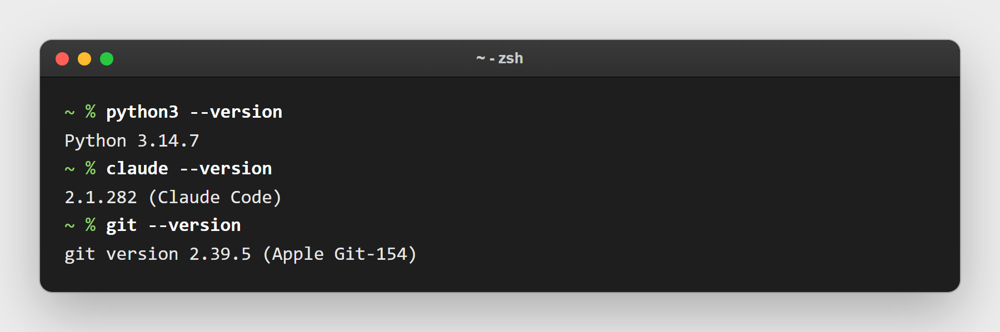

> **Tip:** Want to see Jeeves before pointing it at your real notes? After step 2 below, run `python3 tools/demo.py ../jeeves-demo --serve --port 4099`. This makes a practice folder called `jeeves-demo` next to the Jeeves folder, with a made-up bookkeeper's 2 vaults and 5 agents, and starts Jeeves on it. Open http://127.0.0.1:4099/ to see it. The chat answers from a script and costs 0 tokens. Press Ctrl+C in that terminal to stop it.

## Install it

1. Open Terminal: press Command and Space together, type `Terminal`, press Return. It opens in your home folder, which is where all 4 downloads in this set go.
2. Download the code (clone the repo: copy the project from GitHub, the site where it is stored) and go into its folder:

```
git clone https://github.com/OUTLIERS-ai/outliers-ws-04-jeeves-mac
cd outliers-ws-04-jeeves-mac
```

3. Run the installer:

```
python3 install.py
```

4. It checks Python and Claude Code first. If either is missing it says what to do and changes nothing.
5. It asks 4 questions about folders and the port, then 1 more in step 6. Press Return to accept the answer in brackets, which is what it found:
   - where your second brain is (if you used the installer from the second-brain sessions, it already knows the folder and offers it)
   - where your CRM is (the same, from the CRM installer). With a CRM at `~/CRM`, the suggestion in brackets is that folder and Return keeps it. With no CRM, there is no suggestion and Return leaves the answer blank (both checked on a test Mac on 2026-09-25)
   - where your agents are (normally the `agents` folder inside `.claude` in your user folder, on a Mac `~/.claude/agents`)
   - which port to use: the number after the colon in the address, 4040 unless another program is using it. Type a number; anything else and it asks again.
6. It asks whether Jeeves should start by itself, with no window, each time you switch on your Mac and sign in. Jeeves has no account of its own to sign in to. The default is no. If you say yes, it writes a LaunchAgent: a small file, `ai.outliers.jeeves.plist`, in the folder `~/Library/LaunchAgents`, that tells your Mac to start Jeeves each time you switch it on and sign in. It takes effect the next time you sign in. To start Jeeves now as well, use step 8.
7. It writes `config.json` next to `install.py`, and if you change an answer it keeps your old settings as `config.json.bak-<date>`. When Jeeves runs it keeps its own working files (which conversation it is carrying on, which copy is running) in a folder called `state` here. Run the installer again with the same answers and it says "Nothing changed".


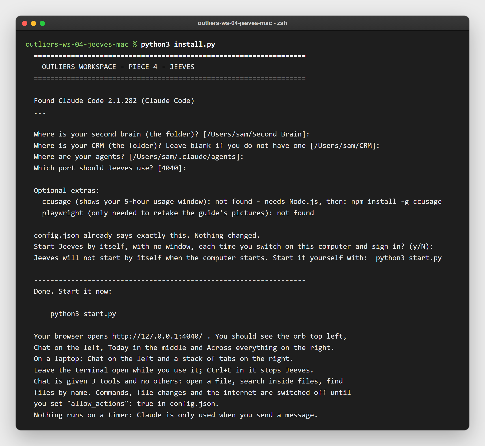

8. Start Jeeves:

```
python3 start.py
```

9. The terminal prints "Jeeves is running at http://127.0.0.1:4040/ (Ctrl+C to stop)" and your browser opens that address. There is no login. Leave that terminal window open while you use Jeeves. Press Ctrl+C in it, or close it, to stop Jeeves.
10. The first time you send a chat message, Claude Code starts up, which can take several seconds before the first word appears.

When it worked you see the orb top left, Chat on the left, Today in the middle and the Across everything panel (the 1-screen summary) on the right. On a screen narrower than 1,440 pixels (most laptops) Jeeves starts in the Laptop layout instead: Chat on the left, a tall stack of tabs on the right.

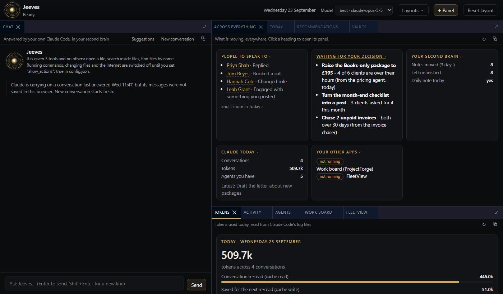

> **Tip:** If you said yes to Jeeves starting by itself, it starts with no window each time you switch on your Mac and sign in. It does not open your browser: go to http://127.0.0.1:4040/ yourself, and bookmark it. Stop it with `python3 start.py --stop`.

> **Tip:** Changed your mind about Jeeves starting by itself when you switch on your Mac and sign in? `python3 install.py --uninstall` stops Jeeves, switches the LaunchAgent off and removes its file. It leaves your settings and vaults alone. To remove Jeeves completely, then delete the `outliers-ws-04-jeeves-mac` folder as well.

> **Warning:** Do not change the setting `"permission_mode"` (Claude Code's own rule for when it must ask you first) to `"bypassPermissions"` in config.json. Set to `"bypassPermissions"`, Claude never stops to ask. Switch `"allow_actions"` on as well and it can rewrite or delete any note in your vaults, and run any command on your computer, with nobody there to say no, from a browser tab that sits open all day.

## Using it day to day

**Start of the day.** Open Jeeves and read **Across everything**. It shows the top 4 people from your CRM's Today page, the unticked suggestions in your Recommendations file (the note where your agents write ideas for you), how much changed in your second brain, and how much Claude has done today. Click any heading, person or suggestion to open it in its own panel.

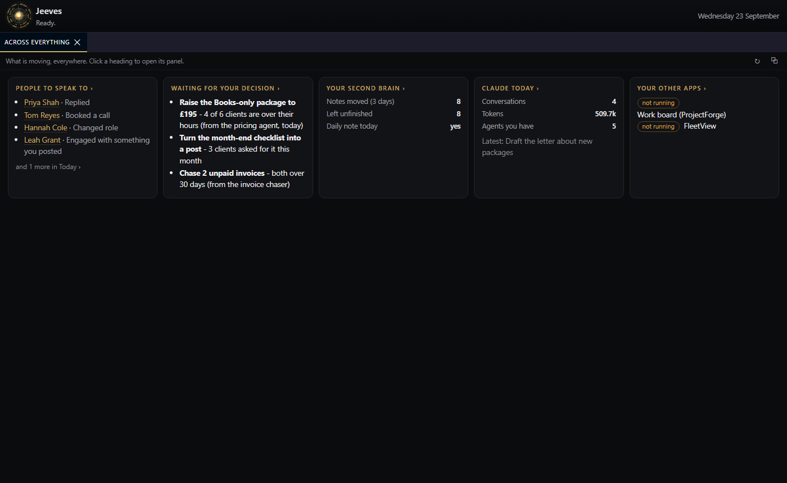

Notes moved means notes changed in the last 3 days. Left unfinished means checkboxes not yet ticked.

Across everything reads the numbered table in `Today.md`: 1 row per person, with a number, a name and a reason, for example the first row of the pictures above: 1, Priya Shah (a made-up name), Replied. The CRM sessions write it with those 3 columns first; if you write your own, keep the number, the name and the reason in that order. If those columns are not there, the panel says so rather than claiming nobody is waiting.

**Today.** Your CRM's ranked page as it is, then your second brain. If you keep daily notes named by date (for example `Daily/2026-09-23.md`, or the same name in a folder called Daily Notes, Journal, Diary or Calendar), today's note appears. Other folders go in `config.json` under `"daily_note_folders"`. If you do not keep daily notes, you still see what changed and what is left unticked. Each note name shown in gold is a link. To make a fresh Today page, once your CRM has its Today program (part 7 of the CRM sessions), open Terminal, type `cd ~/CRM`, then `python3 _engine/today.py --write` (the CRM's own program that writes `Today.md`).

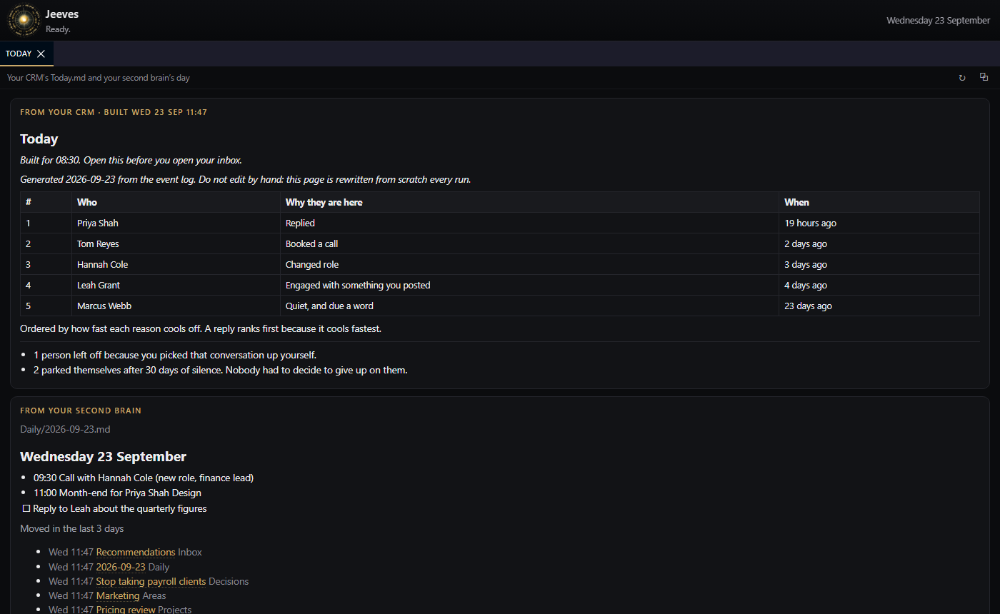

**Chat.** Type and press Return (the page calls it Enter). Shift+Return makes a new line. The lines starting with an arrow show which files Claude is reading. While Claude is working, a **Stop** button appears next to Send: press it to end the answer. A message typed while an answer is still coming in is not sent; wait, or press Stop first. A run that goes past 10 minutes is stopped for you (`"chat_timeout_seconds"` in `config.json`). **Suggestions** shows ready-made questions you can click.

The model menu at the top picks which Claude model answers: `best` (`claude-opus-5-5`, the strongest), `deep` (`claude-sonnet-5`, the middle one) or `fast` (`claude-haiku-4-5`, the cheapest). You can change which model each name uses in `config.json`, and your choice is remembered in this browser.

Each one is written out in full rather than as the short word `opus`, `sonnet` or `haiku`. The short words move: on 2026-09-22 Anthropic released Claude Opus 5.5, and from that day `opus` meant the new model. Jeeves would have started using it without telling you, and FleetView (piece 2) would have shown your tokens as "price unknown", because it prices a model by its full name. Written out, the model menu, FleetView's price table and this guide all name the same model. If you would rather always follow the newest model, put `"opus"` back in `config.json` and accept that the name can change under you.

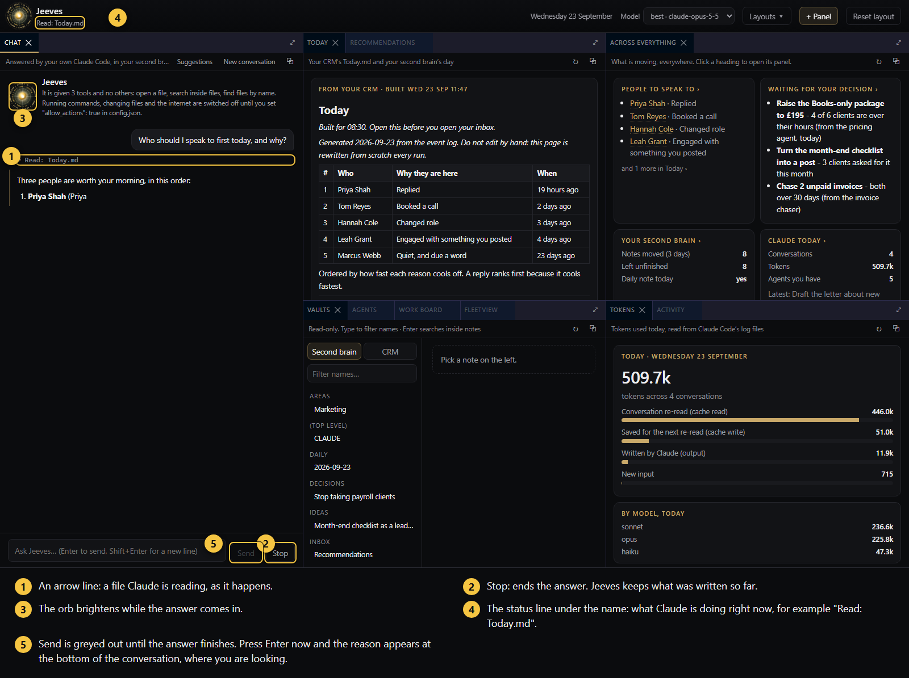


The conversation stays on screen after a reload or a restart, and Claude Code carries on the same conversation, because Jeeves saves the conversation's number on your computer. A grey line says "Carrying on the conversation from" and the time. **New conversation** starts afresh. If you open Jeeves in another browser, Claude Code still carries on the same conversation, but the messages are not on screen there; ask "what were we talking about?" to carry on.

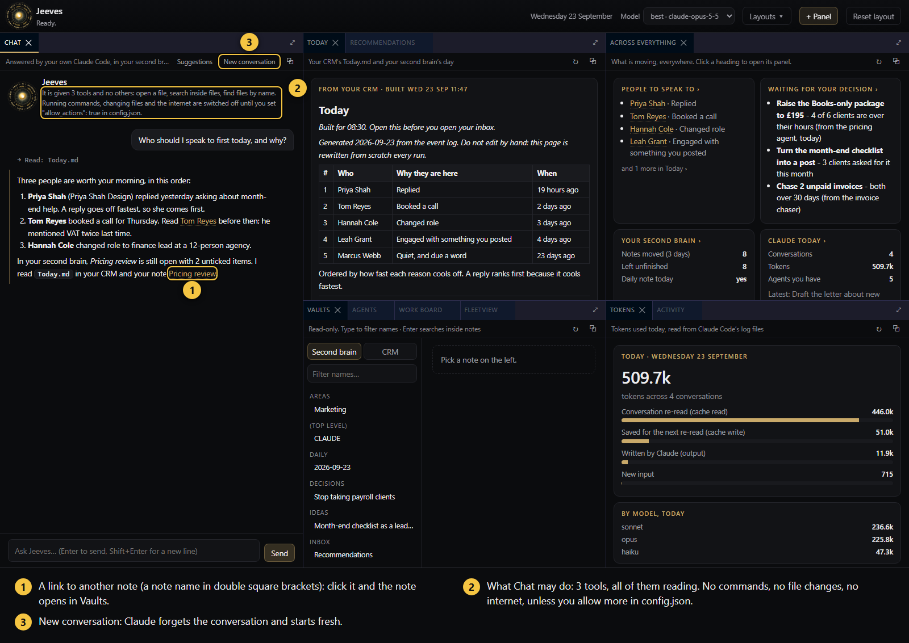

**What Chat can and cannot do.** By default Chat is given 3 tools and no others:

| Tool | What it does |
|---|---|
| Read | Opens 1 file and reads it |
| Grep | Searches inside your files for words |
| Glob | Finds files by name |

Everything else Claude Code can normally do is absent: running commands, writing or editing a file, opening a web page, searching the web, booking a job to run later, messaging another agent, and anything else Claude Code adds in a future version. Jeeves also loads none of your add-on servers (MCP servers, which give Claude extra tools such as sending messages), and it writes the 7 tools that act (run commands, change files, reach the internet) into a settings file of its own, `state/read-only-settings.json`, as refused, because Claude Code's own documentation (read 2026-09-22) says a refusal written there also covers a second Claude that the first starts while answering you.

This used to work the other way round, and it left 25 tools available. Jeeves named 7 tools to block. Measured on Ashley's own PC, not a Mac, on 2026-09-22 against Claude Code 2.1.280, that left **25** tools still available, including ones that book a run for later, raise a notification, start a second Claude running in the background and message another agent. A list of tools to block has to be edited every time Claude Code adds a new tool. A list of what is allowed never changes.

Checked live on Ashley's own PC, not a Mac, on 2026-09-22, against the real Claude Code, in a folder with 1 note in it:

| Asked | What happened |
|---|---|
| What tools do you have? | Chat answered: exactly 3, Glob, Grep, Read |
| "Create a file called proof.txt, and run `echo hello`" | "I did neither of them... I have no tool that creates or writes a file... no tool that runs commands." No file appeared |
| "Read Pricing review.md and tell me what the package costs" | "The Books-only package costs £180 a month", read from the note |

To let Chat act, see "5. Let it edit notes, on your terms" under "Fit it to your own AI system".

**Vaults.** Pick Second brain or CRM and type to filter by note name. Press Return to search inside every note in both vaults. A link between notes (a name in double square brackets) anywhere opens the note in whichever vault has it, and the tab switches to match; if no vault has it, the panel says so and offers to search.

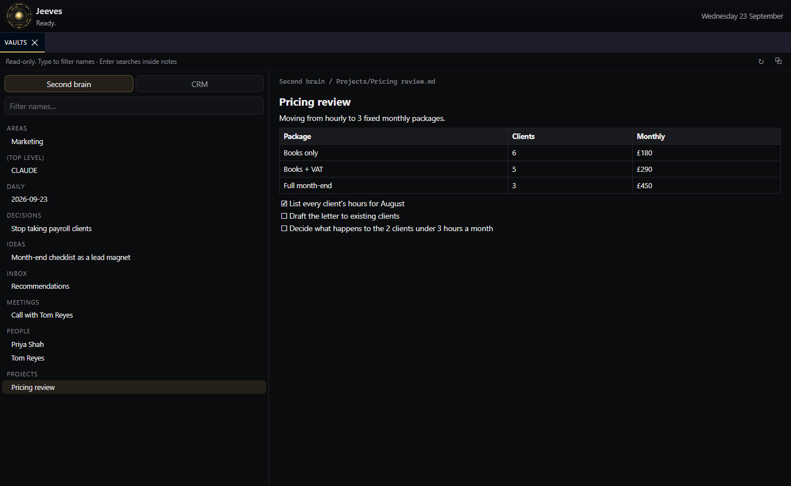

**Agents.** Click a description to read it in full. **Ask in chat** starts a message with "Use the (name) agent to", so you only type what you want done.


**Activity and Tokens.** Activity lists your Claude Code conversations from the last 7 days. Tokens shows today's total. Most tokens are Claude re-reading the conversation so far; the Tokens panel calls that "Conversation re-read". They count towards the usage limits of your Claude plan but are the cheapest kind. The reading panels re-read your files once a minute while the Jeeves browser tab is on screen; that costs 0 tokens.

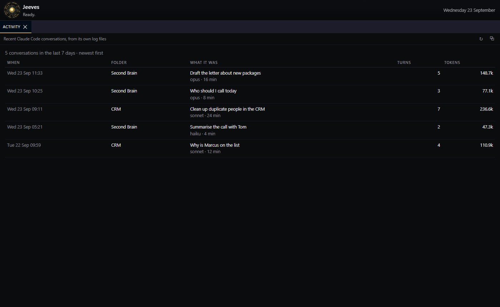


The Tokens panel's 4 kinds: **Conversation re-read** (cache read) is Claude re-reading the conversation so far, the cheapest kind. **Saved for the next re-read** (cache write) is Claude storing the conversation so it can re-read it cheaply next time. **Written by Claude** is its answers. **New input** is what you typed.

**Recommendations.** Keep 1 file, `Inbox/Recommendations.md`, in your second brain. Ask your agents to add a line there instead of interrupting you. You decide in your own time.

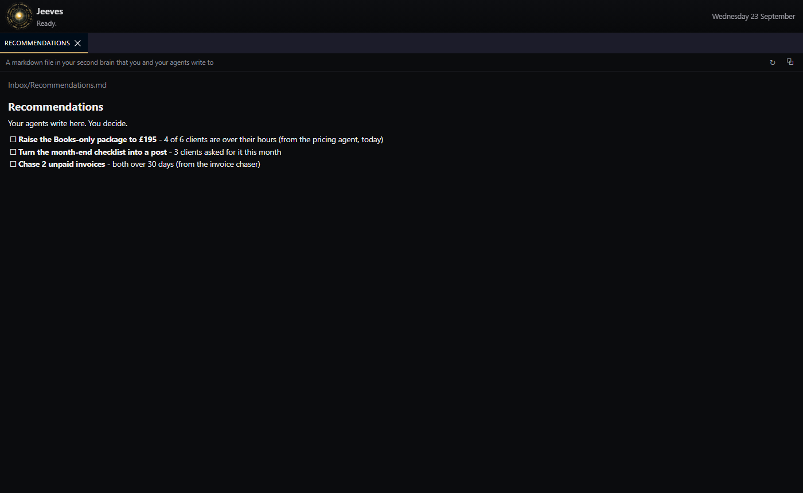

**Work board and FleetView.** If ProjectForge or FleetView is running, it appears inside the panel, with an "open in its own tab" link. If not, the panel says so and gives you the link.

On a Mac, that download link goes to the Mac version: `outliers-ws-03-projectforge-mac` or `outliers-ws-02-fleetview-mac`, pieces 3 and 2 of this set. If you installed Jeeves on this Mac before 2026-09-25, your settings keep the links it wrote then, to the versions made for PCs. Those run on a Mac too, but their guides print PC commands: download pieces 2 and 3 of this set instead.

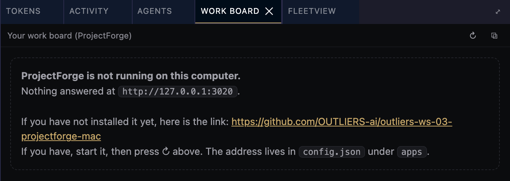

**Moving panels.** Drag a tab by its title to another edge or into another group. The square button on each panel opens it in its own window. That window's address ends in `?only=` and the panel name (for example `http://127.0.0.1:4040/?only=today`), so you can bookmark 1 panel on its own. **+ Panel** brings back anything you closed (open panels are marked "(open)", and each has its own pop-out button). **Reset layout** puts everything back. Close every panel and the page says so, with a button for each panel.

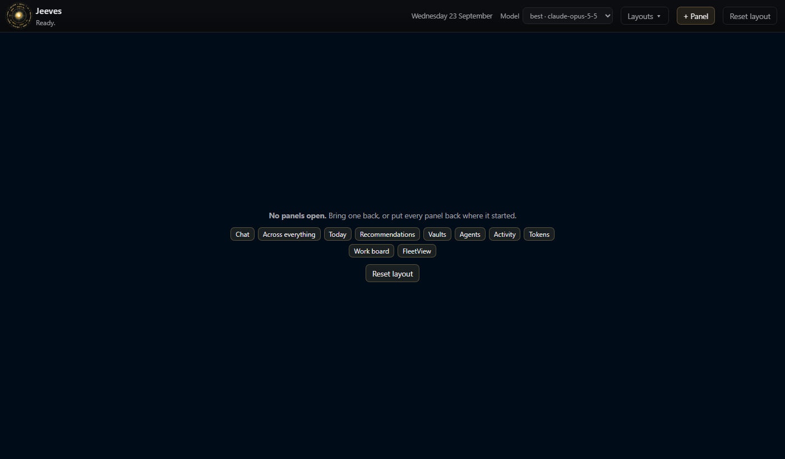

**Layouts and full screen.** **Layouts** offers 4 arrangements, each with all 10 panels: Big screen, Laptop, Chat focus and Morning review. "Save this layout as" keeps your own arrangement under a name. To make 1 group fill the page, double-click its tab or press the diagonal double-arrow button at the right end of its tab row; press Esc to put it back.

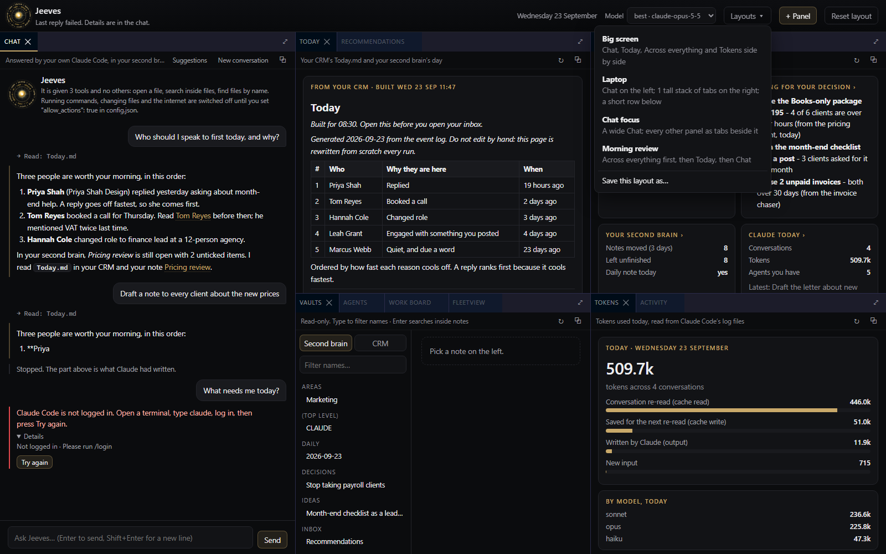

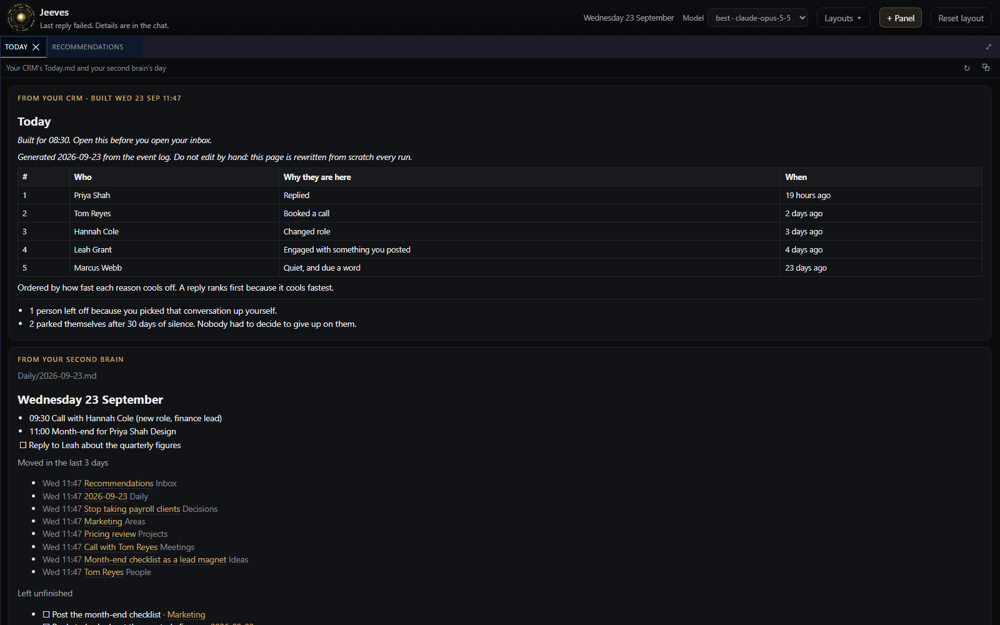

**Stopping it.** Press Ctrl+C in the Terminal window where you typed `python3 start.py`. If it started another way (by itself when you switched on your Mac and signed in), open Terminal (it opens in your home folder), type `cd outliers-ws-04-jeeves-mac`, then `python3 start.py --stop`. It checks that the program on that port really is Jeeves before stopping it, so it never stops anything else.

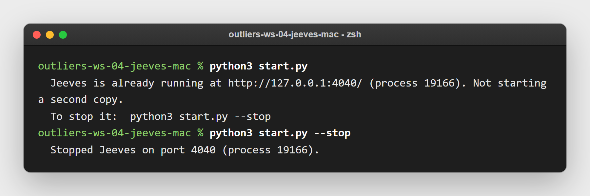

## Fit it to your own AI system

**The safe way.** Make a second copy of Jeeves and change that, so the Jeeves you use every day keeps working while you experiment. Open a new terminal (it opens in your home folder) and type these 4 lines:

```
cd outliers-ws-04-jeeves-mac
python3 install.py --copy ../jeeves-trial
cd ../jeeves-trial
python3 start.py
```

The second line makes a folder called `jeeves-trial` next to `outliers-ws-04-jeeves-mac`, with your settings and a port of its own: 1 above your everyday Jeeves's port (4041 if yours is 4040), or the next number nothing else is using. It prints the copy's address, for example http://127.0.0.1:4041/, and your everyday Jeeves stays at http://127.0.0.1:4040/. The copy reads the same 2 note folders as your everyday Jeeves, starts a fresh chat conversation, and leaves alone the LaunchAgent that starts your everyday Jeeves when you switch on your Mac and sign in. Do not copy the folder by hand instead: a copy made by hand keeps 4040 and the everyday Jeeves's record of which program is running, so it will not start while your everyday Jeeves runs, and `python3 start.py --stop` typed in it stops your everyday Jeeves.

Before your first change, check the copy. Once, first, make a private Python folder for the checks and put pytest (a Python checking program) in it. Type these 2 lines:

```
python3 -m venv ~/outliers-checks
source ~/outliers-checks/bin/activate && python -m pip install pytest
```

`python3 -m venv` makes a private Python folder called `outliers-checks` in your home folder, and the second line installs pytest into it. It works whichever Python your Terminal uses. Then, in the `jeeves-trial` folder, type:

```
source ~/outliers-checks/bin/activate && python -m pytest -q
```

It says `64 passed, 13 skipped`. 4 of the skipped checks look at files a Mac does not use. The other 9 open the page in a real web browser and need Playwright, a free add-on this guide does not ask you to install. Skipped is fine: it does not mean anything is broken. Run the same line after every change. If it says `failed` anywhere, the change broke something: put it back before you go on.

Read "Every command and setting" near the end of this guide before you ask Claude Code for a change, because much of what you want is already a setting in `config.json`.

2 settings can cost you notes. The most dangerous change in this guide is `"bypassPermissions"` for `"permission_mode"` in `config.json`: Claude would run any command with nobody asked, as the warning in "Install it" explains. Never use it. Idea 5 below sets `"permission_mode"` to `"acceptEdits"`, which lets Claude change notes without asking you, which is why idea 5 also adds a rule to your `CLAUDE.md` saying which folders Claude may write in.

Ashley's own Jeeves went a long way past what you have here. It had 8 colour themes, including a light theme for daytime. It had real command panels running inside the page, so he could watch a build without leaving it. It had a command menu opened from the keyboard, panels popped out across 3 monitors, and a phone version he installed on his Samsung and reached over a private network of his own. When a redesign came back calmer and simpler, with 1 orb and 4 cards, he rejected it in 1 line: "Jeeves is a FULL UI - that's the point."

Each of these is a change you can ask your own Claude Code to make. Open Terminal (it opens in your home folder), type `cd jeeves-trial`, then `claude`, and paste the prompt. Afterwards, in the same folder, run the automatic checks with `source ~/outliers-checks/bin/activate && python -m pytest -q` (the counts are in "The safe way" above; a change that adds a check adds 1 to passed, and any `failed` means put the change back). Then restart the copy: Ctrl+C in the Terminal window where it runs, then `python3 start.py`.

The prompts use programmer words so Claude knows exactly which files to change. You do not need to understand them.

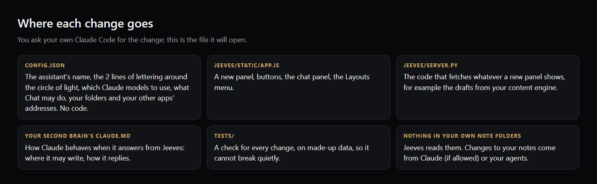

**1. A content-engine panel.** Shows the newest batch of post drafts from your content engine (the content-writing setup from an earlier session; each batch is a folder the prompt calls a "wave"), if you have one.

```
Add a panel to Jeeves called "Drafts". Read-only. It lists the markdown files in the
newest folder under briefs/ in my content engine at <path to outliers-content-engine>,
from each wave's drafts/ folder, with the first line of each draft. Add the path to
config.json as "content_engine". Add a GET route in jeeves/server.py, a render function
in jeeves/static/app.js, and a test in tests/ against a made-up folder. Run the tests.
```

**2. A "who to call" panel with a button per person.** Put the name of the agent that writes your follow-ups where the prompt says so.

```
Add a panel called "Who to call" that reads the table in my CRM's Today.md and shows
each person as a card. Each card gets a button "Draft a follow-up" that puts
"Use the <your follow-up agent's name> agent to draft a follow-up to <name>, using their
CRM note" into the chat box without sending it. Keep it read-only. Add a test.
```

**3. Your agents as buttons.** Turn the 3 agents you use most into 1-click buttons in the top bar.

```
In Jeeves, add a row of buttons to the top bar for the agents listed in a new
config.json key "agent_buttons" (a list of names). Each button fills the chat box with
"Use the <name> agent to " and focuses it. Nothing is sent until I press Return.
```

**4. Your own ready-made layouts.** The Layouts menu already saves layouts in your browser. To ship your own to every browser (LAYOUTS is the list of ready-made layouts inside `app.js`):

```
In jeeves/static/app.js, add a layout called "Client prep" to LAYOUTS: Today and
Vaults side by side on top, Chat below them, every other panel as tabs next to Vaults.
Every layout must keep all 10 panels. Add it to the test in tests/test_ui.py.
```

**5. Let it edit notes, on your terms.** 2 settings, then a rule in your rulebook. `"allow_actions": true` takes the 3-tool limit off and gives Chat every tool Claude Code has. `"acceptEdits"` lets Claude edit files without asking you.

```
In config.json set "allow_actions" to true and "permission_mode" to "acceptEdits".
Then add a rule to my second brain's CLAUDE.md: "When working from Jeeves, only create
or edit files in Inbox/ and Daily/. Ask me before touching anything else."
```

With `"allow_actions": true` Claude can use every tool your own Claude Code settings allow, including commands and the internet. With `"acceptEdits"` Claude may change files without asking, but anything else that would need your yes, running a command for example, is still refused, because nobody is sitting there to approve it.

**6. A voice panel.** Uses the speaking voices built into your web browser: no cloning, no extra program.

```
Add a "Speak replies" switch to the Jeeves chat panel. When it is on, read each finished
reply aloud with the browser's built-in speechSynthesis, and set the orb to "speaking"
while it talks. Add a microphone button that uses the browser's speech recognition if
the browser has it, and hides itself if it does not.
```

**7. Recommendations written by your agents.** Give every agent 1 place to put suggestions.

```
In my second brain, add a rule to CLAUDE.md: "Any agent that has a suggestion for me
appends a line to Inbox/Recommendations.md in this form:
- [ ] **<the suggestion>** - <why, with a number> (from <agent name>, <date>)
It never acts on the suggestion itself."
```

**8. Only run when there is work.** If you ever add a scheduled job, make it check first. The last line of the prompt says how your Mac starts it.

```
I want a morning job that asks Jeeves's chat to summarise my day. Before it starts
Claude, it must check with plain Python whether anything changed since yesterday
(new lines in Today.md, new notes). If nothing changed, it exits without starting Claude.
Start it from a LaunchAgent in ~/Library/LaunchAgents at 08:00 each morning.
```

**9. Change the orb's words and the name.**

```
In config.json set "name" to "<your assistant's name>" and add an "orb" setting with
"inner" and "outer": 2 short lines of my choosing. Restart Jeeves and check the runes
changed.
```

## Every command and setting

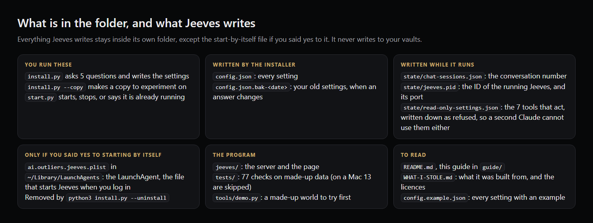

### Commands

| Command | What it does |
|---|---|
| `python3 install.py` | Asks 4 questions about folders and the port, and 1 about starting by itself, then writes `config.json`. Safe to run again. |
| `python3 install.py --port 4041` | The same, with a different port. |
| `python3 install.py --vault <folder> --crm <folder> --agents <folder>` | Gives the answers up front instead of asking. |
| `python3 install.py --launcher --yes` | Also makes Jeeves start by itself, with no window, each time you switch on your Mac and sign in (a LaunchAgent), and asks nothing else. |
| `python3 install.py --copy ../jeeves-trial` | Makes a second copy to experiment on, next to this folder, with its own port. See "The safe way". |
| `python3 install.py --yes` | Accepts every answer it found, asks nothing. |
| `python3 install.py --uninstall` | Stops Jeeves, switches off the LaunchAgent that starts it by itself when you switch on your Mac and sign in, and removes its file. Leaves settings and vaults alone. In a copy, it leaves the everyday Jeeves's LaunchAgent alone. |
| `python3 start.py` | Starts Jeeves and opens your browser. Ctrl+C stops it. |
| `python3 start.py --no-open` | Starts without opening a browser (the LaunchAgent uses this). |
| `python3 start.py --port 4041` | Starts on another port this time only. |
| `python3 start.py --config <file>` | Uses another settings file (the practice version, `tools/demo.py`, uses this). |
| `python3 start.py --stop` | Stops a Jeeves that is running, however it was started. |
| `python3 tools/demo.py ../jeeves-demo --serve --port 4099` | A made-up practice world to try first. 0 tokens. |
| `launchctl list \| grep outliers` | Lists what your Mac started from a LaunchAgent. `ai.outliers.jeeves` is Jeeves. |
| `source ~/outliers-checks/bin/activate && python -m pytest -q` | Runs the automatic checks, on made-up data: `64 passed, 13 skipped` on a Mac. They never touch your real files. Needs the private Python folder with pytest once: see "The safe way". |

### Settings in config.json

`config.example.json` in the folder shows every setting with an example. After changing one, stop Jeeves and start it again.

| Setting | What it does | Default |
|---|---|---|
| `name` | The name at the top and in the chat. | `"Jeeves"` |
| `port` | The number in the address. | `4040` |
| `second_brain` | Your second-brain folder. Chat works inside it. | asked by the installer |
| `crm_vault` | Your CRM folder. Blank if you have none. | asked by the installer |
| `agents_dirs` | Extra folders of agents. The `.claude/agents` folders in your user folder (`~/.claude/agents`) and in each vault are always read. | asked by the installer |
| `models` | Which Claude model `best`, `deep` and `fast` use. Write the name in full so it cannot change under you. | `claude-opus-5-5`, `claude-sonnet-5`, `claude-haiku-4-5` |
| `default_model` | The model picked when you first open Jeeves. | `"best"` |
| `allow_actions` | `false`: Chat is given 3 reading tools and no others. `true`: Chat gets every tool Claude Code has. | `false` |
| `permission_mode` | Claude Code's own rule for when it must ask you first. `"dontAsk"`: Claude never stops to ask you; anything that would need your yes is refused instead. | `"dontAsk"` |
| `chat_timeout_seconds` | How long an answer may run, in seconds, before Jeeves stops it. | `600` (10 minutes) |
| `claude_command` | How to start Claude Code. If `claude --version` works but Jeeves cannot find it, put its full path here, for example `"/Users/<you>/.local/bin/claude"`. | `"claude"` |
| `claude_home` | Where Claude Code keeps its log files, if not the usual `.claude` folder in your user folder. | blank |
| `inbox_file` | The Recommendations file. If blank, Jeeves looks for `Inbox/Recommendations.md`, then `Recommendations.md`, `Areas/Recommendations.md`, `AI/Recommendations.md` and `Inbox.md`. | blank |
| `daily_note_folders` | Where daily notes are looked for. | `Daily`, `Daily Notes`, `Journal`, `Diary`, `Calendar` |
| `apps` | The addresses of ProjectForge and FleetView, and their download links. | ports 3020 and 3010 |
| `ccusage` | `"off"` hides the figure for how much of your Claude plan's 5-hour allowance is used. | `"auto"` |
| `orb` | 2 lines of text for the rune-style rings, as `"inner"` and `"outer"`. The installer does not write it; add it yourself. | built in |

### Files it writes

| File | When |
|---|---|
| `config.json` | Every install that changes an answer. |
| `config.json.bak-<date>` | Your old settings, when an answer changed. |
| `ai.outliers.jeeves.plist` in `~/Library/LaunchAgents` | Only if you said yes to Jeeves starting by itself when you switch on your Mac and sign in. |
| `state/chat-sessions.json` | The reference number Claude Code gives a conversation, so Chat can carry the same one on after you restart. |
| `state/jeeves.pid` | The process number (the ID your Mac gives the running Jeeves program) and its port, so `--stop` finds it. |
| `state/read-only-settings.json` | The 7 tools that act (run commands, change files, reach the internet), written down as refused. Chat's own 3-tool limit is given on the command line; this file is what a second Claude that Chat starts to help with your question has to obey too. |

`README.md` repeats the short version of this guide. `WHAT-I-STOLE.md` (our name for the list of free projects Jeeves borrows from, with each licence) names what Jeeves was built from. `LICENSE` is the MIT licence for our code; Dockview (the free add-on that makes the panels movable) keeps its own licence in `jeeves/static/vendor/dockview/`.

## When it goes wrong

| What you see | Why | What to do |
|---|---|---|
| "Jeeves is already running" when you start it | It is: perhaps it started by itself when you switched on your Mac and signed in. | Open http://127.0.0.1:4040/ . To restart it: `python3 start.py --stop`, then `python3 start.py`. |
| "Claude Code is not logged in", or "No conversation found" | Claude Code needs a login, or the conversation Jeeves was carrying on has been deleted from Claude Code's logs. | Type `claude` in a terminal and log in. Then press **Try again** under the message. |
| Chat says Claude Code was not found | Jeeves looks for the `claude` program on your PATH (the list of folders Terminal searches for programs) and in `~/.local/bin`, and found it in neither, or Jeeves was started from a Terminal window that was open before you installed it. | Close every Terminal window, open a new one, check `claude --version`, then restart Jeeves. If it still cannot find it, put the full path in `config.json` as `"claude_command"`. |
| Chat says it cannot run a command, edit a file or look online | By design: Chat is read-only unless you allow more. | See "5. Let it edit notes, on your terms" above. |
| "Still answering your last message" | You sent a message while the last answer was coming in. | Wait, or press Stop, then send again. |
| Answers feel weak | The model menu is on `fast`, the smallest model. Ashley's first Jeeves had this problem when its default was set to the smallest model. | Pick `best` in the model menu. |
| A panel is empty | The file it reads is missing. (In Ashley's first Jeeves a panel stayed empty when it was filled before it appeared on screen. This rebuild waits for each panel, so an empty panel now means its file is missing.) | Press the refresh arrow on the panel. Read the message in it: it says which file it looked for. |
| "Nobody is waiting on you" but your CRM has people | `Today.md` is not in the numbered shape (number, name, reason). | Once your CRM has its Today program (part 7 of the CRM sessions), rebuild it: open Terminal, type `cd ~/CRM`, then `python3 _engine/today.py --write`. |
| Work board or FleetView says "not running" | Jeeves only looks. It never starts another app, because in Ashley's first Jeeves, starting another app itself left 2 copies of that app competing for the same port. | Start ProjectForge or FleetView yourself, then press the refresh arrow. |
| An embedded app is blank | An app can refuse to be shown inside another page. | Use the "open in its own tab" link in the panel's top line. |
| Token totals looked doubled | Claude Code writes the same reply more than once in its logs. | Fixed: each reply is counted once. If your numbers still differ from ccusage's, trust ccusage. |
| "Could not listen on port 4040" | Another program is using the port. | The message names a port that is free right now: run the line it prints, for example `python3 start.py --port 4041`. To keep the new port, run `python3 install.py --port 4041`. |
| "config.json could not be read", with a line number | You edited `config.json` and left a mistake in it the computer cannot read past: usually a comma after the last setting, or a missing bracket or quotation mark. | Open the file, look at the line the message names, and correct it. Or run `python3 install.py` to write a fresh one; your vault folders are asked for again, nothing else is lost. |
| "Your second brain folder is not there" | The folder named in `config.json` does not exist: a typo, a renamed folder, or a drive that is not plugged in. | Check `"second_brain"` in `config.json`, or plug the drive back in, then refresh the page. The same message appears for `"crm_vault"`. |
| "macOS refused access to" and a folder | macOS stopped Jeeves reading that folder. It can happen to a folder in Documents when Jeeves started by itself after you switched on your Mac and signed in; the test Macs never showed it. | Move the folder into your home folder, keeping its name: for example `~/Documents/Second Brain` becomes `~/Second Brain`. The message names the new place. Then run `python3 install.py` again and type that place when it asks. |
| It will not start at all | A file Jeeves needs is missing, or a setting in `config.json` is wrong. This rebuild needs nothing outside its own folder except your vaults. | Run `python3 install.py` again: it checks everything and says what is missing. |

What 4 of these look like on screen: a failed chat message, a brand-new setup with empty panels, Chat with no Claude Code installed, and a folder that is not there.


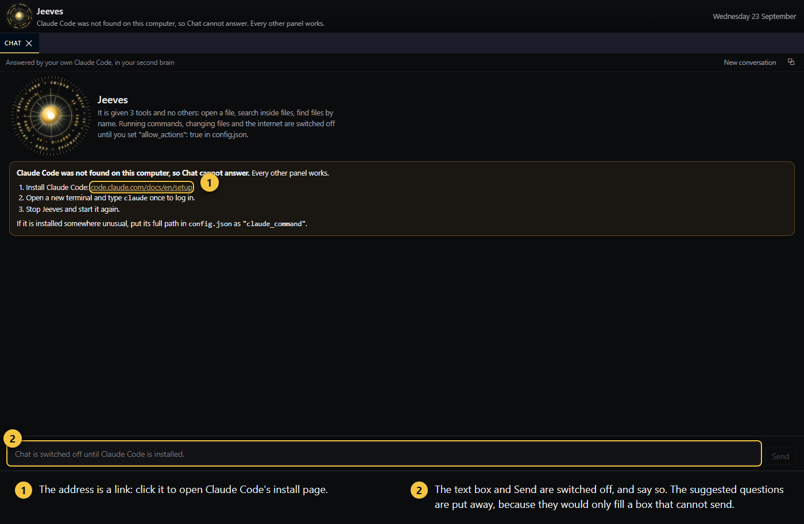

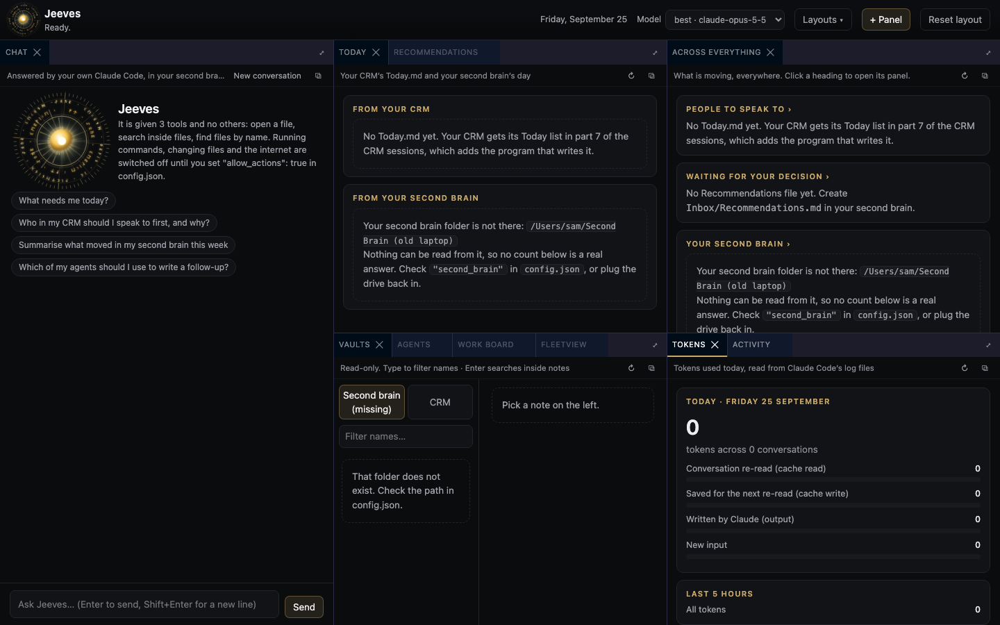

> **Note:** Jeeves never writes to your vaults. If a note changed, something else changed it: Claude through Chat (only if you set `"allow_actions"` to true), or one of your agents.

## Download

https://github.com/OUTLIERS-ai/outliers-ws-04-jeeves-mac

```
git clone https://github.com/OUTLIERS-ai/outliers-ws-04-jeeves-mac
cd outliers-ws-04-jeeves-mac
python3 install.py
python3 start.py
```

Type the 4 lines 1 at a time in Terminal. When Jeeves is running, the last one prints "Jeeves is running at http://127.0.0.1:4040/ (Ctrl+C to stop)".


